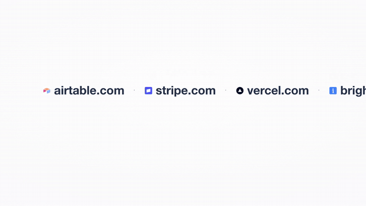
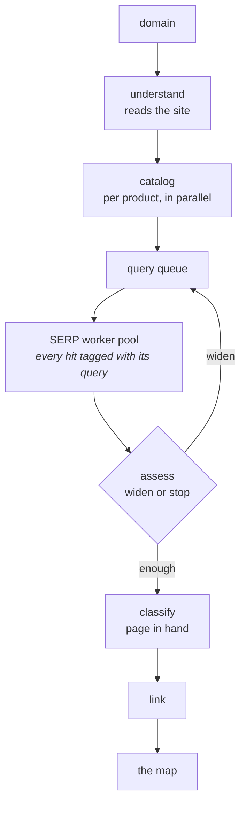

<div align="center">


# open&#183;knowledge base

### One domain in, knowledge base out

**[→ Try the beta](https://open-kb-demo.vercel.app)**

</div>

Point it at your domain and it maps the whole market — competitors,
substitutes, integrations, buyers, and where the market argues. It never
searches the company's name: it works out the job each product does and
searches for the job. Every claim carries a URL and a literal quote from a page
the run fetched, and the map exports as a folder of markdown your agent can
walk, with `llms.txt` at the door.



<sub>The launch film — [watch it with sound](./assets/launch.mp4)</sub>

<div align="center">

## [→ Open the demo](https://open-kb-demo.vercel.app)

[vercel.com](https://open-kb-demo.vercel.app/kb/sweep-vercel-com-202608062351) ·
[stripe.com](https://open-kb-demo.vercel.app/kb/sweep-stripe-com-202608070005) ·
[brightdata.com](https://open-kb-demo.vercel.app/kb/sweep-brightdata-com-202608042230)
— or [read a map as markdown](./examples/kb-clerk-com/README.md)

</div>

## Quickstart

Node 20+, a [Bright Data](https://brightdata.com) account with a SERP and an
Unlocker zone, and an [OpenRouter](https://openrouter.ai) key.

```bash
git clone https://github.com/mo-root/open-kb.git && cd open-kb && pnpm install
cp .env.example .env      # four keys, named in the file
pnpm sweep yourcompany.com
```

```
runs/sweep-yourcompany-com-<stamp>.json   every entity, edge and span

kb-yourcompany-com/                       pnpm run export <run>
├── entities/     one file per company, with its quotes
├── relations/    competitor · substitute · integration · buyer
├── segments/     each market, and who is in it
└── llms.txt      the door an agent comes in through
```

## The agents

Five agents, one judgement each, every answer in a schema. Each is a markdown
prompt in [`prompts/`](./prompts) — changing how the engine thinks is a text
edit.

| agent | owns | runs |
|---|---|---|
| **understand** | what the company sells, and which products share a market | once per run |
| **catalog** | a product's de-branded queries — the job, never the name | once per product |
| **assess** | widen or stop, between rounds | up to four times |
| **classify** | what a host is, with its page in hand | once per host |
| **link** | how two entities relate | 40 pairs a call |



## What the agents cannot do

Agentic where the answer is a judgement, code where the answer is a guarantee:

| guarantee | held by |
|---|---|
| A citation exists only if its quote is a literal substring of bytes this run stored | [`core/src/evidence.ts`](./packages/core/src/evidence.ts) — no fallback branch |
| A description with zero verified spans never reaches a reader | [`core/src/judge.ts`](./packages/core/src/judge.ts) |
| `competitor` and `substitute` need that host's own readable page — a listicle nominates, it never convicts | [`core/src/verdict.ts`](./packages/core/src/verdict.ts) |
| A claim that loses its evidence keeps its place and wears the refusal | same path — downgrade, never delete |
| An edge to a node nobody found gets dropped | the sweep refuses dangling edges |
| Every paid call lands on the run's live meter, under a hard cap | [`core/src/ledger.ts`](./packages/core/src/ledger.ts) |

A model having a bad day writes a weak query or misreads a host. It cannot
fabricate a citation or blind a market.

## The second engine: the swarm

The sweep buys breadth in one pass; the swarm buys depth. A lead agent writes
missions onto a priced board, six lanes claim and work them with search and
page tools, and every mission reserves its allowance before any work starts. A
finish the scorecard objects to comes back refused — work clears a refusal,
restating the objection does not.

```bash
pnpm swarm yourcompany.com 5                          # depth, with a ceiling
pnpm swarm yourcompany.com 5 --from-sweep runs/<run>  # interrogate a sweep's map
```

[ARCHITECTURE.md](./ARCHITECTURE.md) covers both engines phase by phase;
[DEPLOY.md](./DEPLOY.md) covers putting it on a host.

## Every command

```bash
set -a && source .env && set +a   # the CLI reads keys from the shell

pnpm sweep yourcompany.com        # breadth: the map
pnpm swarm yourcompany.com 5      # depth, with a ceiling
pnpm run export <run> vault  # the map as a folder of markdown
pnpm run diff a.json b.json  # what moved between two runs of one anchor
pnpm run audit <run>         # deal a review packet, score it symmetrically
pnpm test                    # 1,387 tests, no network, no keys

cd packages/web && pnpm dev  # the app, http://localhost:3210
```

## Drive it from your coding agent

An [Agent Skill](https://platform.claude.com/docs/en/agents-and-tools/agent-skills/overview)
at [`skills/mapping-markets`](./skills/mapping-markets) teaches Claude Code and
other agents to run maps, read them, and tune the query doctrine:

```bash
npx skills add mo-root/open-kb/skills/mapping-markets
```

## Layout

```
open-kb/
├── packages/
│   ├── core/        pure logic: evidence mint, query families, span accounting
│   ├── providers/   Bright Data SERP + Unlocker, OpenRouter wiring
│   ├── sweep/       the breadth engine, one file
│   ├── swarm/       the depth engine: a lead, a funded board, six lanes
│   └── web/         Next.js: live run surface and the map
├── prompts/         every judgement, as editable markdown
└── skills/          the Agent Skill
```

## Stack

**Bright Data** (SERP API, Web Unlocker) for searches that do not get blocked ·
**OpenRouter** via AI SDK 7, answers typed with Zod · **Next.js 16** for the
app · **Supabase** optional locally, required on Vercel.

## License

MIT. Use it, fork it, ship it.

<div align="center">

<sub>Built on Bright Data's web infrastructure. Not affiliated with, endorsed by, or sponsored by Bright Data.</sub>

</div>
