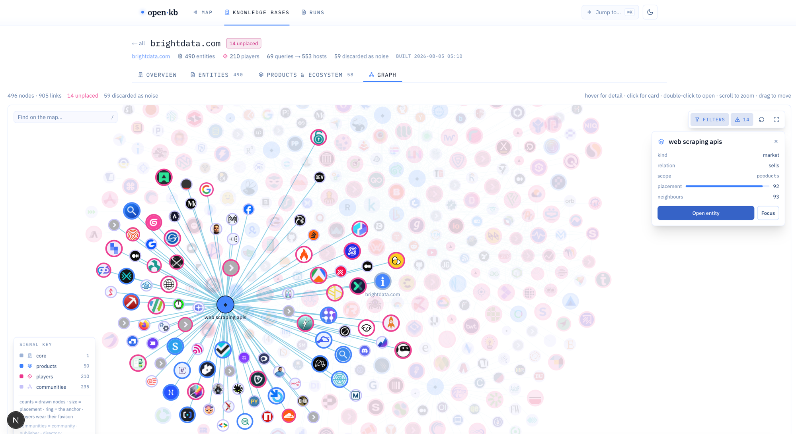
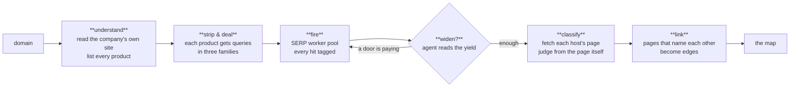
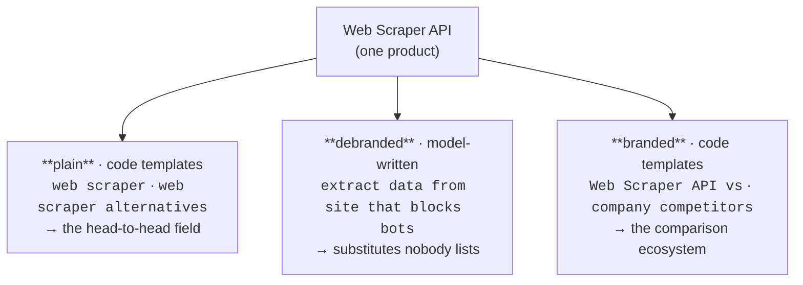
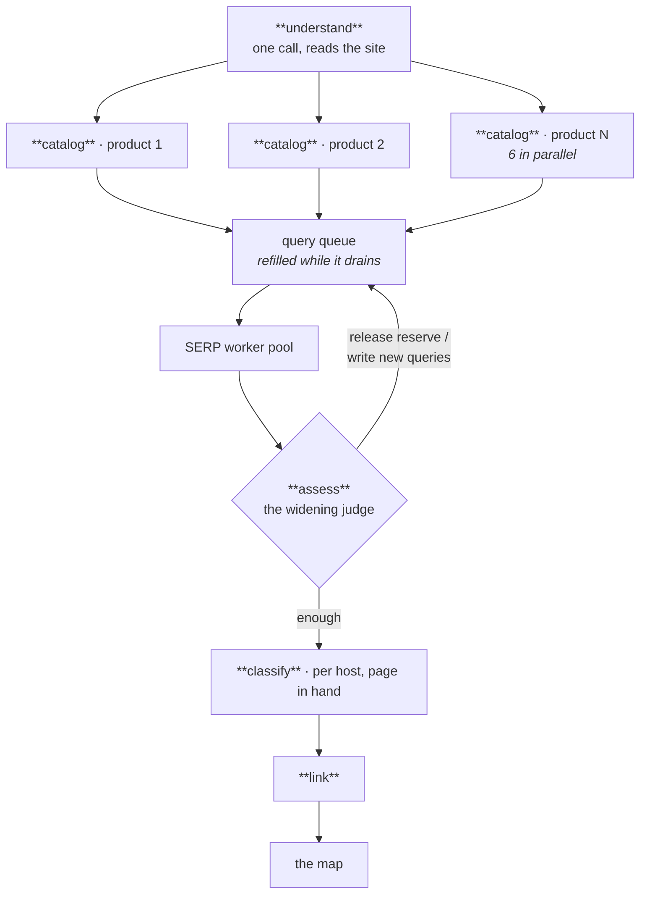

<div align="center">

# open-kb

**The open-source market mapper.**
Give it a domain, get back a cited map of the ecosystem around it — competitors, substitutes, communities, and the receipts on every claim. Powered by an agent sweep wired into Bright Data's web infrastructure.

<br />

[](./LICENSE)
[](https://nodejs.org)
[](https://nextjs.org)
[](https://sdk.vercel.ai)
[](https://brightdata.com)

</div>

<br />

<!-- ─────────────────────────────────────────────────────────────────────── -->

<div align="center">

> ### **▶ Demo**


<sub>4× speed — [**watch the full demo with audio**](./assets/demo.mp4) (1m26s)</sub>

<sub>Or skip the install: <a href="./examples/kb-clerk-com/README.md"><b>browse a real exported map, checked into this repo</b></a> — clerk.com, 263 entities, every claim with its receipt.</sub>

</div>

<br />

<!-- ─────────────────────────────────────────────────────────────────────── -->

## The idea

If you search **"Stripe competitors"**, you get the articles everyone already read. open-kb never searches the company's name to find its market. Instead it:

1. **Reads the company's own site** and lists everything it sells
2. **Strips each product of its brand** — `Web Scraper API` becomes `web scraper`
3. **Searches for the job, not the name** — and the companies that answer are competitors by evidence, not by reputation

That includes the ones no comparison article has ever listed: the open-source tool people outgrow, the substitute solving the same problem a completely different way, the new player with no press.



<sub>One run on `brightdata.com`: **490 entities · 210 players · 69 queries → 553 hosts**. The lit cluster is a single market — *web scraping apis* — and every node on it was found by that market's searches, wears its own favicon, and carries its citations.</sub>

<br />

<!-- ─────────────────────────────────────────────────────────────────────── -->

## Why this exists

| | Market-intel vendors | Asking an LLM | **open-kb** |
|---|---|---|---|
| **Where answers come from** | curated databases | model memory | live searches, this run |
| **Finds substitutes & long tail** | rarely | sometimes, unverifiable | yes — that's the method |
| **Citation on every claim** | rare | no | every node and edge: URL + quote |
| **Cost per map** | contracts | free but uncheckable | about a dollar (~$0.001/entity, measured), metered live |
| **Self-hosted** | no | — | yes |

<br />

<!-- ─────────────────────────────────────────────────────────────────────── -->

## How it works

One domain becomes one run. Agents make the judgement calls; code enforces the guarantees.



### The three query families

Every product's queries are dealt across three families, because each one opens a different door into the same market:



The boring families are **code** — no model can have a clever day and skip the query that finds the center of a market. The clever family is **model-written**, because that's where judgement pays. Every entity on the map records which product's search found it, through which door.

<!-- Screenshot: searches panel with family chips — assets/families.png -->

<br />

<!-- ─────────────────────────────────────────────────────────────────────── -->

## The agents

Every agent in open-kb is the same three things: **a markdown prompt** (its beliefs, editable in [`prompts/`](./prompts)), **a Zod schema** (its output type — the model cannot return prose), and **a metered call** (its tokens and dollars land on the run's bill as it happens). No framework, no graph library — the orchestration is plain TypeScript you can read in one file.

| agent | fires | what it judges |
|---|---|---|
| **understand** | once | reads the company's own pages: what it sells, every product, which products share a market, which words are invented brand names |
| **catalog** | once **per product**, 6 in parallel | strips the product to the terms a buyer would type, judges whether its name is too generic to search, writes that product's debranded queries |
| **assess** | between rounds | the widening judge — reads what every family returned for every product, and decides: release held queries where a door is paying, switch doors where results repeat, or say *enough* |
| **classify** | once per undecided host | judges each host from its fetched front page. Aggregator-shaped and unreadable hosts are settled by code for $0 before any model is asked; a claim that fails the evidence bar lands as `unknown` with the refusal attached, never as a guessed competitor |
| **link** | once | where two entities' pages name each other, judges what the relationship is |
| **discover** | standalone (`pnpm discover`) | a tool-loop investigator: maps a site's product pages, reads the ones it chooses, follows leads, submits products one by one, decides itself when the catalogue is complete |

How they compose into one run:



### What the agents decide — and what they can't

The design rule the whole engine is built on: **agentic where the answer is a judgement, code where the answer is a guarantee.**

Agents decide: what a company really sells, what to type next after seeing what came back, whether a market is exhausted, what a host actually is once its page is fetched.

Agents **cannot**: mint evidence for a page that was never fetched (one code path owns that, and it verifies the quote), skip the plain query family (templates fire regardless), search the company's own name outside the branded family (a code filter drops the query), or spend past the dollar ceiling (the harness refuses the run).

So a model having a bad day can write a weak query or misjudge a host — it cannot fabricate a citation, blind a market, or run up a bill. The failure modes are bounded by construction, not by hoping the prompt was good enough.

<br />

<!-- ─────────────────────────────────────────────────────────────────────── -->

## The second engine: the swarm

The sweep is breadth — one pass, every market, hundreds of hosts. The swarm is depth. A **lead** agent reads the map so far and posts investigations to a shared board; **investigator** lanes claim them, work them with search and page tools, and file claims. Between the investigators and the map sits the machinery the whole engine answers to:

- **The admit gate.** A claim about a company only lands if it cites that company's *own* fetched page. Third-party listicles can nominate a host; they can never convict it.
- **Downgrade, never delete.** A claim that loses its evidence is downgraded with the refusal reason attached — the map remembers what it declined to believe, and shows you.
- **The scorecard.** The run may not end because the model feels done. A code-side scorecard says what's still uncovered, and the lead answers to it before the run is allowed to finish.

```bash
pnpm swarm brightdata.com 5                # depth-first map, $5 ceiling
pnpm swarm brightdata.com 5 --from-sweep runs/sweep-brightdata-com-<stamp>.json
```

The second form is the intended shape: **the sweep finds the field cheaply, the swarm interrogates it.** Everything the sweep mapped arrives as leads; the swarm's job is to turn nominations into convictions or refusals.

<br />

<!-- ─────────────────────────────────────────────────────────────────────── -->

## Receipts, or it doesn't exist

The trust layer, enforced in code:

- **Every claim carries a literal quote from a page this run fetched.** There is one code path that mints evidence, and it refuses quotes that weren't actually retrieved.
- **Every dollar is billed live.** Each model call, SERP query and page fetch lands on the run's meter as it happens — you watch the bill during the run, and the report states what it truly cost.
- **Every entity knows its origin.** Which product's search surfaced it, which query family, which market it hangs on.
- **The company's own catalog links to the pages that establish it.** Nothing on the map is unclickable.

<!-- Screenshot: an entity with its citations — assets/receipts.png -->

### The instruments

Trust claims are cheap, so open-kb ships the instruments to check its own:

- **The audit** — `pnpm run audit runs/<run>.json` deals a deterministic, seeded sample of the map's claims as a fillable review packet, and `--score` refuses to grade one unless the verdicts were reviewed *symmetrically* (re-checking only the rows marked "wrong" can only ever lower the rate — that's not a review, it's a thumb on the scale). The Wilson interval always prints beside the rate, because "3.3% wrong" at n=30 is honestly "0.6%–16.7%".
- **The drift** — `pnpm run diff runs/a.json runs/b.json` compares two runs of the same anchor: what appeared, what vanished, what changed relation or confidence. A map is a snapshot; drift is how you know what moved between yesterday's and today's.
- **The bake-off** — `pnpm run bakeoff <domain>` runs the identical probe across model configs and writes one table to `runs/experiments/`: dollars, wall seconds, hosts, competitors, recall. The default model is the winner of that table, not a preference — the current one took the last bake-off on cost and competitor coverage at once.

<br />

<!-- ─────────────────────────────────────────────────────────────────────── -->

## Quick start

You'll need a [Bright Data](https://brightdata.com) account with two zones (**SERP API** and **Web Unlocker**), plus an [OpenRouter](https://openrouter.ai) key for the LLM layer.

```bash
# 1. Clone and install
git clone https://github.com/mo-root/open-kb.git
cd open-kb
pnpm install

# 2. Configure
cp .env.example .env
# fill in:
#   OPENROUTER_API_KEY
#   BRIGHTDATA_API_TOKEN
#   BRIGHTDATA_SERP_ZONE
#   BRIGHTDATA_UNLOCKER_ZONE

# 3. Run the web app
cd packages/web && pnpm dev
# open http://localhost:3210 — type a domain, watch the run, get the map
```

### Or skip the UI

```bash
set -a && source .env && set +a   # the CLI reads your keys from the shell
pnpm sweep stripe.com        # breadth: the full sweep map
pnpm swarm stripe.com 5      # depth: the swarm, $5 ceiling
pnpm discover stripe.com     # just phase one: what does this company sell?
pnpm test                    # 873 tests, no network, no keys needed
```

<br />

<!-- ─────────────────────────────────────────────────────────────────────── -->

## The map is a folder

Every run exports to plain markdown — a **vault** that an agent (or you) can walk with nothing but a file reader:

```
kb-clerk-com/
├── README.md             # the map, summarized: segments, counts, the honest stats
├── SKILL.md              # teaches an agent how to read this vault
├── llms.txt              # the standard agent entrypoint
├── AGENTS.md             # ground rules: what the tiers mean, what "unknown" means
├── entities/             # one file per company — role, segment, receipts
├── relations/            # competitor.md, substitute.md, integration.md …
├── segments/             # each market, with its members
└── evidence/receipts.md  # every quote, tied to the page it came from
```

**[Browse a real one — the clerk.com map, checked into this repo.](./examples/kb-clerk-com/README.md)** 263 entities from a $0.25 probe run. Start at [`entities/auth0-com.md`](./examples/kb-clerk-com/entities/auth0-com.md), or the [competitor index](./examples/kb-clerk-com/relations/competitor.md), and notice that the refusals are right there on the page — an entity the engine couldn't convict says so, with the reason.

In the web app it's the **Export** button — same vault, zipped. From the CLI:

```bash
pnpm run export runs/sweep-clerk-com-<stamp>.json my-vault   # one run → one vault
pnpm run export --all                                        # every run → an indexed knowledge lake
```

The vault is a build artifact: regenerate it from the run file, never hand-edit it.

<br />

<!-- ─────────────────────────────────────────────────────────────────────── -->

## Or drive it from your coding agent

open-kb ships an [Agent Skill](https://platform.claude.com/docs/en/agents-and-tools/agent-skills/overview) at [`skills/mapping-markets`](./skills/mapping-markets) that teaches Claude Code and other agents how to run maps, read them, and tune the query doctrine.

```bash
npx skills add mo-root/open-kb/skills/mapping-markets
```

<br />

<!-- ─────────────────────────────────────────────────────────────────────── -->

## The judgements are files you can edit

Everything the models are told lives in [`prompts/`](./prompts) as plain markdown — the doctrine for what makes a good query, how to read a page, when a market is exhausted. Changing how the engine thinks is a text edit, not a rebuild.

```
prompts/
├── doctrine/        shared beliefs — search craft, evidence rules, query families
└── agents/          one file per judgement — understand, catalog, assess, classify, link
```

The split that matters: **guarantees are code, judgements are prompts.** The evidence mint, the query templates, the anchor-name filter and the billing hold no matter what a model does.

<br />

<!-- ─────────────────────────────────────────────────────────────────────── -->

## Project layout

```
open-kb/
├── packages/
│   ├── core/        pure logic — evidence mint, query families, url canon,
│   │                span accounting. No env, no vendor names, no HTTP.
│   │                A purity gate in CI enforces it.
│   ├── providers/   Bright Data SERP + Unlocker clients (zone rotation,
│   │                rate-aware pacing), OpenRouter wiring.
│   ├── sweep/       the engine — understand → strip → deal → fire →
│   │                widen → classify → link → report.
│   └── web/         Next.js 16 app — live run surface + the map.
│
├── prompts/         every judgement, editable markdown
├── scripts/         CLI entry points (sweep, discover, read)
├── skills/          the Agent Skill
└── tests/           vitest — all offline
```

<br />

<!-- ─────────────────────────────────────────────────────────────────────── -->

## Tech stack

| Layer | Choice | Why |
|---|---|---|
| Data access | **Bright Data** (SERP API, Web Unlocker) | searches that don't get blocked, pages that actually load |
| LLM layer | **OpenRouter** via **AI SDK 7** | model-agnostic; every call typed with **Zod** structured output |
| Web app | **Next.js 16** + **React 19** + **Tailwind v4** | live NDJSON streaming, resumable across reconnects |
| Persistence | **Supabase** (optional) | spans written as they happen — a crashed run stays readable |
| Safety | spend ceiling + span accounting | the app refuses runs past a dollar ceiling you set |

<br />

<!-- ─────────────────────────────────────────────────────────────────────── -->

## Roadmap

Shipping today: the sweep, the swarm, the widening loop, live metering, the cited map, the vault export and knowledge lake, the audit/drift/bake-off instruments, the web app, the Agent Skill.

Next:
- **Run journals** — each run writes what worked; the next run on that market reads it first. The self-evolving substrate.
- **Checkpointed runs** — a sweep that loses the network mid-flight should resume from its last round, not die wholesale
- Deeper community and channel mapping — where buyers argue, not just who sells

<br />

<!-- ─────────────────────────────────────────────────────────────────────── -->

## Contributing

PRs welcome. Three things worth knowing:

1. **`pnpm check && pnpm test` before pushing.** The check includes a purity gate: `packages/core` may not touch env, vendors, or HTTP.
2. **Guarantees stay code, judgements stay prompts.** A PR that moves one into the other needs a reason.
3. **Numbers, not adjectives.** Changes to the engine should come with a before/after on a real domain.

<br />

<!-- ─────────────────────────────────────────────────────────────────────── -->

## License

MIT. Use it, fork it, ship it.

<br />

<div align="center">

<sub>Built on Bright Data's web infrastructure. The internet is the dataset.</sub>

</div>
