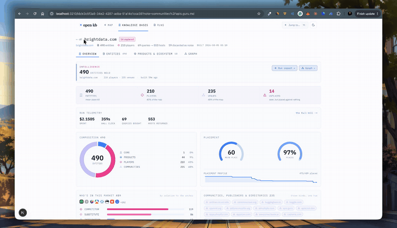
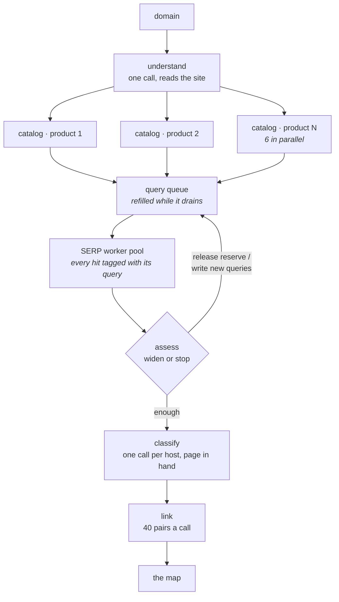
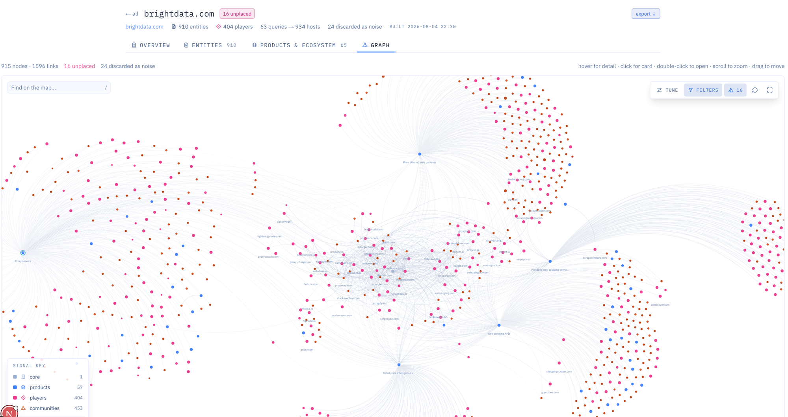
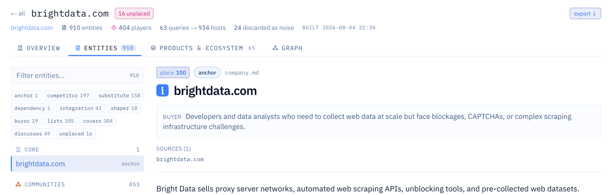

<div align="center">


# open&#183;knowledge base

### Any market, mapped from one domain

[](./LICENSE)
[](https://nodejs.org)
[](https://brightdata.com)
[](https://open-kb-demo.vercel.app)

</div>

**Six real maps are live and free to open, no install and no keys:
[open-kb-demo.vercel.app](https://open-kb-demo.vercel.app)**

**One domain in. The whole market out.** Point it at `stripe.com` and it comes
back with everyone chasing the same buyer, the tools people use instead, who
buys, and where the market argues.

- **It never searches the company's name.** It reads the company, works out the
  job each product does, and searches for the job. That is how a run finds the
  open-source tool people outgrow and the substitute no comparison article lists.
- **Every claim carries its receipt.** A URL and a literal quote from the page
  the run fetched. One function mints a citation and it has no fallback branch:
  a quote that is not in the bytes throws, and the claim never lands.
- **A folder, not a dashboard.** Every run exports to markdown an agent walks
  with a file reader, with `llms.txt` at the door.

> Across the 22 runs in this repo, the median map is **951 entities on the map for
> $1.21 and eight minutes**, about a tenth of a cent an entity. Two-thirds of that
> is search, not tokens. `pnpm bench` prints that table from the run files, so you
> can check it rather than believe it.


## [→ Open the demo](https://open-kb-demo.vercel.app)

[vercel.com](https://open-kb-demo.vercel.app/kb/sweep-vercel-com-202608062351)
2,370 entities · [stripe.com](https://open-kb-demo.vercel.app/kb/sweep-stripe-com-202608070005)
2,551 · [brightdata.com](https://open-kb-demo.vercel.app/kb/sweep-brightdata-com-202608042230)
a description on every row. Or [read one as markdown](./examples/kb-clerk-com/README.md).

```bash
pnpm sweep stripe.com
```

```
runs/sweep-stripe-com-<stamp>.json   every entity, edge, span and dollar

kb-stripe-com/                       pnpm run export <run>
├── entities/     one file per company, with its quotes
├── relations/    competitor · substitute · integration · buyer
├── segments/     each market, and who is in it
└── llms.txt      the door an agent comes in through
```

## Install

Node 20+, a [Bright Data](https://brightdata.com) account with a SERP and an
Unlocker zone, and an [OpenRouter](https://openrouter.ai) key.

```bash
git clone https://github.com/mo-root/open-kb.git && cd open-kb && pnpm install
cp .env.example .env      # four keys, named in the file
pnpm sweep stripe.com
```

<div align="center">



<sub>The app itself. <a href="./assets/demo.mp4">Watch the full walkthrough</a> (51s).</sub>

</div>

<br />

<!-- ─────────────────────────────────────────────────────────────────────── -->

## The agents

One domain becomes one run. Agents make the judgement calls, code enforces the
guarantees, and that split is the whole design.

The breadth engine, `sweep`, is five of them. Each agent is one call to a model with
one judgement it owns, and each answers in a schema. `understand` reads the site
and lists what it sells. `catalog` turns a product into searches. `assess` decides
between rounds whether to widen or stop. `classify` says what a host is once its
page is in hand. `link` says how two entities relate. Around them sits TypeScript
that none of them can talk their way past.

| agent | the call it owns | what it gets to see | how many run |
|---|---|---|---|
| **understand** | what the company sells, its products, which of them share a market, which words it invented | up to three of its own pages, fetched free, plus the product pages in its sitemap | one per run |
| **catalog** | the terms to strip from a product, whether the name is too generic to search on, that product's debranded queries | one product, its market, its siblings, its buyer, and the coinages it may not type | one per product, six at a time |
| **assess** | widen or stop, and which held queries to release | yield per family and per product, the angles already worked, 60 sample hosts | serial, four rounds at most |
| **classify** | what this host is, and how it stands to the anchor | 4,000 characters of that host's own front page | one per undecided host, eight at a time |
| **link** | the relation between two entities whose pages name each other | up to 40 pairs and their descriptions | one call per 40-pair batch, every batch at once |

Each agent is three things: a markdown prompt you can edit in
[`prompts/`](./prompts), a schema its answer has to fit, and a metered call whose
tokens and dollars land on the run's bill as they happen. `composePrompt` splices
the shared doctrine files into each prompt and `render` throws on a placeholder
that is missing or unused, so a broken prompt fails before it costs a cent. No
framework, no graph library. The sweep is one file you can read start to finish,
[`packages/sweep/src/sweep.ts`](./packages/sweep/src/sweep.ts), 2,512 lines.

`classify` runs with reasoning off and a 450-token cap because it fires once per
host and carries 95% of the model spend on a map. `understand`, the per-product
planning and `link` together come in under six cents on every one of the nine
current runs.



Two more agents ship and neither engine runs them: `discover`
([`packages/core/src/discovery.ts`](./packages/core/src/discovery.ts)) is a tool
loop that maps a site's product pages, follows leads, and decides when the
catalogue is done, and `investigate`
([`packages/core/src/investigator.ts`](./packages/core/src/investigator.ts)) is
the search, fetch, read and remember loop behind the demo script. `pnpm discover`
and `scripts/demo-investigate.ts` are their only callers.

### It never types the company's name

Search "Stripe competitors" and you get the articles everyone already read.
`catalog` strips each product down to the job it does, so `Web Scraper API`
becomes `web scraper`, and the run searches for the job. Whoever answers is
chasing the same buyer: the open-source tool people outgrow, the substitute that
solves the problem another way, the company nobody has written a listicle about.
Every entity records which product's search found it and through which family.



<sub>One run on `brightdata.com`. <b>910 entities · 404 companies · 123 queries → 934 hosts.</b> Each cluster is a market the run went looking for: proxy servers, web scraping apis, pre-collected web datasets. Every node there came from that market's own searches and carries its citations. The 16 marked <b>unplaced</b> turned up in results and fit nowhere. They stay on the map instead of vanishing.</sub>

<br />

<!-- ─────────────────────────────────────────────────────────────────────── -->

## What the agents cannot do

The rule the engine is built on: agentic where the answer is a judgement, code
where the answer is a guarantee. Agents decide what a company sells, what to type
after seeing what came back, whether a market is exhausted, and what a host is
once its page is in hand. This is the other half, and it is the half worth
reading.

| the guarantee | the code that holds it |
|---|---|
| **Evidence mint.** A citation exists only if its quote is a literal substring of bytes this run stored. Whitespace squashed, case folded, eight characters minimum. | `EvidenceStore.cite` and `checkQuote` in [`core/src/evidence.ts`](./packages/core/src/evidence.ts). There is no fallback branch. |
| **Span gate.** A description with zero verified spans never reaches a reader. Code replaces it with a sentence saying so. | [`core/src/judge.ts`](./packages/core/src/judge.ts), using the mint's own containment check |
| **Template families.** Code writes the plain and branded queries. A model writes the debranded family, where judgement pays. | `openingHand` and `companyHand` in [`core/src/families.ts`](./packages/core/src/families.ts) |
| **Anchor filter.** A non-branded query that names the anchor or one of its coinages gets dropped, at the opening and again inside the widening loop. | `banned()` in the same file, applied in both places |
| **Admit gate.** `competitor` and `substitute` need that host's own readable page. A listicle nominates a host. It never convicts one. | `admit` in [`core/src/verdict.ts`](./packages/core/src/verdict.ts), called from the judge and from the swarm's tools |
| **Downgrade, never delete.** A claim that loses its evidence keeps its place on the map and wears the refusal. | same path; the node keeps its slot carrying `because` |
| **Two ends that already exist.** An edge to a node nobody found gets dropped. | the sweep drops dangling edges; `resolveEndpoint` refuses to invent one |
| **The finish gate.** A run does not end because the model feels done. | `finishTool` in [`swarm/src/tools-control.ts`](./packages/swarm/src/tools-control.ts), two refusals at most |
| **The ledger.** Reserve, draw, settle, on every paid thing. | [`core/src/ledger.ts`](./packages/core/src/ledger.ts) |

A model having a bad day writes a weak query or misreads a host. It cannot
fabricate a citation or blind a market.

### Two things this does not hold

**The aggregator rule ships off.** Half of the admit gate demotes a page that
links out to N vendor domains, turning it into `directory/lists`.
`aggregatorThreshold` defaults to `null` in both engines and `null` becomes
infinity, so that half never fires until you set a number. All 22 stored sweeps
carrying a kernel block ran with it off and demoted zero hosts on it. The
commercial-stance half is live and does fire.

**The spend ceiling brakes starting runs, not running ones.** The web app refuses
to begin a run once cumulative model spend crosses your limit. It cannot halt a
run already going, it does not meter web access, and two requests can pass it
together. Put `KB_USER` and `KB_PASSWORD` on anything reachable, and read
[DEPLOY.md](./DEPLOY.md).

<br />

<!-- ─────────────────────────────────────────────────────────────────────── -->

## The second engine: the swarm

The sweep buys breadth in one pass. The swarm buys depth, and it is the stranger
machine.

A lead agent holds one conversation and writes its own questions onto a board.
[`Board`](./packages/core/src/board.ts) is a priority queue with two bands
enforced at push: the lead posts at 61 to 100, an investigator's proposals at 1 to
60. Six lanes claim missions and work them with search and page tools. Dedupe is
exact string match on the mission key, because a similarity threshold silently
deletes the model's ideas.

Neither role ever sees a model id. Missions are priced in tiers and a tier is the
only name cost has here: peek $0.03 and 60 seconds, read $0.10 and 180, dig $0.25
and 300, harvest $0.45 and 300. `spawn` reserves the allowance before any work
starts and refuses in a sentence when the pool cannot fund it. Every SERP row and
every fetch draws its real dollars at the wire. At 80% drawn the runner tells the
investigator how much is left and to write down what it has. At 1.5x it stops the
next turn, which makes the wall advisory by construction: the worst measured
overrun is 1.9x, $0.189 against a $0.10 claim. Landing settles at actuals and the
surplus goes back to the pool. `popAffordable` takes the highest priority whose
allowance fits what is spendable, scans down only, and narrates every item it
passed over.

An investigator answers in a computed digest capped at 120 tokens. The harness
reads that digest and never the prose around it.

- **The scorecard.** Code computes what the map is still missing, and a finish it
  objects to comes back refused, at most twice, and only while the lead has turns
  left to answer in. Work clears a refusal: a page the lead fetched that the run
  held neither the address nor the bytes of, or a mission the lead itself
  commissioned coming home. Restating the objection clears nothing. The gate
  charges lead-commissioned work only, and a kill-and-respawn cannot launder a
  harness key into the lead's name. An obstinate lead gets refused twice, then
  ends the run in its own words, and `report.scorecard.gate` records what the gate
  asked for, what followed, and which rule let the finish through.
  [ARCHITECTURE.md](./ARCHITECTURE.md#the-finish-gate) has the exact rules and why
  each one exists.

```bash
pnpm swarm brightdata.com 5                # depth-first map, $5 ceiling
pnpm swarm brightdata.com 5 --from-sweep runs/sweep-brightdata-com-<stamp>.json
```

The second form is the intended shape. The sweep finds the field cheaply and the
swarm interrogates it. Everything the sweep mapped arrives as leads, and the
swarm turns nominations into convictions or refusals.

Price it as depth. Eight stored swarm runs cost $0.28 to $2.77 and returned 5 to
28 nodes each, which is 118 times the sweep's cost per entity. The swarm is CLI
only. The web app runs the sweep.

<br />

<!-- ─────────────────────────────────────────────────────────────────────── -->

## Why this exists

| | Market-intel vendors | Asking an LLM | **open-kb** |
|---|---|---|---|
| **Where answers come from** | curated databases | model memory | searches this run bought |
| **Finds substitutes and the long tail** | rarely | sometimes, unverifiable | yes, by construction |
| **Citations** | rare | none | URL and quote on every node it could read. A node it could not read says why |
| **Cost per map** | contracts | free, uncheckable | **Metered live, and the meter is in the repo.** Median $1.21 for 951 entities on the map across 22 runs, and the range is wide: $0.17 to $2.24 on one anchor in ten hours. Two-thirds search, one-third tokens |
| **Self-hosted** | no | | yes |

<br />

<!-- ─────────────────────────────────────────────────────────────────────── -->

## Receipts, or it does not exist

- **Every claim carries a literal quote from a page this run fetched.** One code
  path mints evidence and it refuses a quote nobody retrieved.
- **Every dollar bills live.** Each model call, SERP query and page fetch lands on
  the run's meter as it happens, at $0.0015 a result page and three pages a
  question, $0.008 for an unlocked fetch, $0 for a page that loads on its own. The
  default model is `deepseek/deepseek-v4-flash` at $0.14 and $0.28 per million
  tokens, so the model half of a median map is 45 cents. You watch the bill during
  the run, and the report states what it cost.
- **The unit price barely moves.** $0.0009 per entity, between $0.0008 and $0.0010
  across nine anchors from `linear.app` at $0.28 to `shopify.com` at $3.74.
- **Every entity knows its origin.** Which product's search surfaced it, which
  family, which market it hangs on.
- **A host the run could not read is recorded, not hidden.** Roughly one host in
  six refuses to load, and the run keeps each one with the reason it failed. The
  exported vault leaves those pages out and says how many in its own README,
  because a page whose only content is "this named company's site refused us on
  one day" helps nobody. The count stays. The accusation goes.



<sub>Each entity gets typed by how it relates to you (competitor, substitute, integration, buyer, shaper) and carries the sources the claim rests on.</sub>

### Instruments

Trust claims are cheap, so open-kb ships the instruments to check its own.

- **The audit.** `pnpm run audit runs/<run>.json` deals a seeded sample of the map's claims as a review packet. `--score` refuses to grade one unless the verdicts were reviewed symmetrically, because re-checking only the rows marked wrong can only lower the rate. The Wilson interval prints beside the rate: "3.3% wrong" at n=30 honestly means 0.6% to 16.7%.
- **The drift.** `pnpm run diff runs/a.json runs/b.json` compares two runs of one anchor and shows what appeared, what vanished, and what changed relation or confidence.
- **The bench.** `pnpm bench` reads every artifact in `runs/` and prints the results table. Nothing in it gets typed by hand.
- **The bake-off.** `pnpm run bakeoff <domain>` runs one probe across model configs and writes a table to `runs/experiments/`: dollars, wall seconds, hosts, competitors, recall. The default model won that table on cost, at $0.29 against $0.54 to $2.24. It placed third of five on wall seconds and fourth on hosts found, and it was picked for the price. It did not win on correctness: the audit packets exist to measure a wrong rate and nobody has scored one yet, so no model here carries a verified quality number. Run the bake-off on your own anchor before you trust the default for yours.

<br />

<!-- ─────────────────────────────────────────────────────────────────────── -->

## Every command

```bash
set -a && source .env && set +a   # the CLI reads keys from the shell

pnpm sweep stripe.com        # breadth: the map
pnpm swarm stripe.com 5      # depth, $5 ceiling
pnpm discover stripe.com     # phase one only: what does this company sell?
pnpm run export <run> vault  # the map as a folder of markdown
pnpm run diff a.json b.json  # what moved between two runs of one anchor
pnpm run audit <run>         # deal a review packet, score it symmetrically
pnpm bench                   # the results table, read out of runs/
pnpm test                    # 1,387 tests, no network, no keys
```

The web app runs the same engine, with a run sized to whatever clock its host
allows:

```bash
cd packages/web && pnpm dev   # http://localhost:3210
```

<br />

<!-- ─────────────────────────────────────────────────────────────────────── -->

## The map is a folder

Every run exports to plain markdown. An agent or a person walks it with nothing but a file reader.

```
kb-clerk-com/
├── README.md             # the map summarised: segments, counts, honest stats
├── SKILL.md              # teaches an agent to read this vault
├── llms.txt              # the standard agent entrypoint
├── AGENTS.md             # ground rules: how to read a row, what it does not claim
├── entities/             # one file per company: role, segment, quotes
├── relations/            # competitor.md, substitute.md, integration.md …
└── segments/             # each market and its members
```

**[Read the clerk.com map that ships in this repo.](./examples/kb-clerk-com/README.md)** 137 entities from one probe run: 42 competitors, 34 substitutes, 29 integrations.

The export carries the map and leaves the crawl behind. That run touched 129 more
hosts and gave none of them a page: 55 it judged unrelated, 47 it could not read,
26 publishing near the market rather than in it, 1 refused without a reason. The
vault's own README counts them. Start at
[`entities/auth0-com.md`](./examples/kb-clerk-com/entities/auth0-com.md) or the
[competitor index](./examples/kb-clerk-com/relations/competitor.md). A claim the
engine could not ground says so on its own page:
[`entities/scalekit-com.md`](./examples/kb-clerk-com/entities/scalekit-com.md)
carries no receipt, and its description admits it.

The web app has an **Export** button for the same vault, zipped. From the CLI:

```bash
pnpm run export runs/sweep-clerk-com-<stamp>.json my-vault   # one run, one vault
pnpm run export --all                                        # every run, one indexed lake
```

Regenerate the vault from its run file. Never hand-edit it.

<br />

<!-- ─────────────────────────────────────────────────────────────────────── -->

## Drive it from your coding agent

open-kb ships an [Agent Skill](https://platform.claude.com/docs/en/agents-and-tools/agent-skills/overview) at [`skills/mapping-markets`](./skills/mapping-markets) that teaches Claude Code and other agents to run maps, read them, and tune the query doctrine.

```bash
npx skills add mo-root/open-kb/skills/mapping-markets
```

<br />

<!-- ─────────────────────────────────────────────────────────────────────── -->

## The judgements are files you can edit

Everything the models get told lives in [`prompts/`](./prompts) as markdown: what makes a good query, how to read a page, when a market is exhausted. Changing how the engine thinks is a text edit.

```
prompts/
├── doctrine/        shared beliefs: search craft, evidence rules, query families
└── agents/          one file per judgement: understand, catalog, assess, classify, link
```

Guarantees stay in code and judgements stay in prompts. The evidence mint, the query templates, the anchor-name filter and the billing hold whatever a model does.

<br />

<!-- ─────────────────────────────────────────────────────────────────────── -->

## Layout

```
open-kb/
├── packages/
│   ├── core/        pure logic: evidence mint, query families, url canon,
│   │                span accounting. No env, no vendor names, no HTTP.
│   │                A purity gate enforces it under `pnpm check`.
│   ├── providers/   Bright Data SERP and Unlocker clients, OpenRouter wiring.
│   ├── sweep/       the breadth engine, one file.
│   ├── swarm/       the depth engine: a lead, a funded board, six lanes.
│   └── web/         Next.js 16: live run surface and the map.
│
├── prompts/         every judgement, as editable markdown
├── scripts/         CLI entry points
├── skills/          the Agent Skill
└── tests/           vitest, all offline
```

[ARCHITECTURE.md](./ARCHITECTURE.md) covers the port contracts, the purity gate, the evidence model, and both engines phase by phase.

<br />

<!-- ─────────────────────────────────────────────────────────────────────── -->

## Stack

| Layer | Choice | Why |
|---|---|---|
| Web access | **Bright Data** (SERP API, Web Unlocker) | searches that do not get blocked, pages that load |
| Models | **OpenRouter** via **AI SDK 7** | model-agnostic, answers and tool calls typed with **Zod** |
| Web app | **Next.js 16**, **React 19**, **Tailwind v4** | NDJSON streaming that survives a reconnect |
| Persistence | **Supabase** (optional locally, required on Vercel) | spans written as they happen, so a crashed run stays readable |

<br />

<!-- ─────────────────────────────────────────────────────────────────────── -->

## Roadmap

Shipping today: both engines, the widening loop, live metering, the cited map, the vault export, the audit and drift and bench and bake-off instruments, the web app, the Agent Skill.

Next:
- **Run journals.** Each run writes what worked, and the next run on that market reads it first.
- **Checkpointed runs.** A sweep that loses the network mid-flight should resume from its last round.
- Deeper community mapping: where buyers argue, not only who sells.

<br />

<!-- ─────────────────────────────────────────────────────────────────────── -->

## Contributing

PRs welcome. Three things worth knowing:

1. Run `pnpm check && pnpm test` before you push. The check includes a purity gate: `packages/core` may not touch env, vendors or HTTP.
2. Guarantees stay code and judgements stay prompts. Moving one into the other needs a reason.
3. Numbers, not adjectives. A change to the engine comes with a before and after on a real domain.

<br />

<!-- ─────────────────────────────────────────────────────────────────────── -->

## License

MIT. Use it, fork it, ship it.

<br />

<div align="center">

<sub>Built on Bright Data's web infrastructure. The internet is the dataset.</sub>

<sub>Not affiliated with, endorsed by, or sponsored by Bright Data.</sub>

</div>
